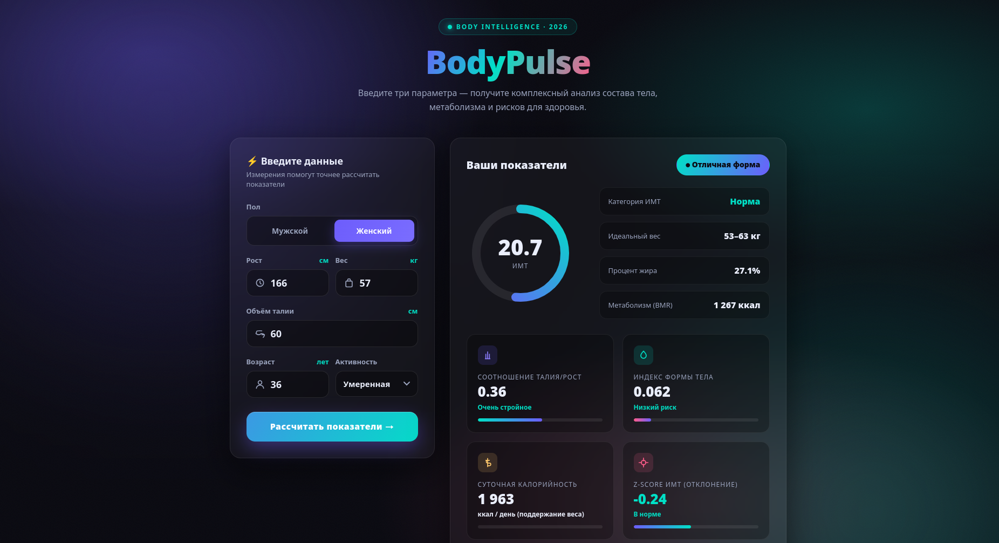

# ⚡ BodyPulse


> **BodyPulse** — лёгкий веб-калькулятор и аналитик показателей тела: ИМТ, процент жира, метаболизм и риски для здоровья. Введите рост, вес и окружность талии — получите комплексный разбор в красивом dark-glass интерфейсе.

---

## 📸 Скриншот

_Место для скриншота интерфейса — добавьте изображение, например `docs/screenshot.png`, и вставьте его здесь._

```markdown

```

---

## 📌 Обзор

**BodyPulse** — это одностраничное приложение (SPA) на чистом HTML/CSS/JS. Оно принимает три базовых измерения тела и рассчитывает сразу несколько клинически значимых показателей, сопровождая их наглядными анимациями, прогресс-барами и персонализированными рекомендациями.

Работает **офлайн**, без сборщиков и зависимостей — просто откройте файл в браузере.

---

## ✨ Ключевые показатели

| Показатель | Что показывает |
|-----------|----------------|
| 📊 **ИМТ** | Индекс массы тела + категория и анимированный кольцевой индикатор |
| 🧬 **Процент жира** | Оценка по формуле Deurenberg с поправкой на талию |
| 🗻 **Соотношение талия/рост (WHtR)** | Кардионагруженность и распределение жира |
| 🧩 **Индекс формы тела (ABSI)** | Риск по z-оценке с учётом формы тела |
| ⚖️ **Идеальный вес** | Диапазон по методу Девайна |
| 🔥 **Базальный метаболизм (BMR)** | Энергия, нужная в покое (Миффлин-Сан Жеор) |
| ⚡ **Суточная калорийность (TDEE)** | Поддержание / похудение / набор веса |
| ✅ **Общая оценка формы** | Сводный вердикт + блок рекомендаций |

---

## 🛠 Технологии

- **HTML5 / CSS3 / Vanilla JavaScript** — без фреймворков и сборщиков
- **Glassmorphism** + анимированный «аврора»-фон, неоновые градиенты
- Плавные анимации, микроинтеракции, прогресс-бары
- Полностью **адаптивная** вёрстка (десктоп / планшет / мобильный)

---

## 🚀 Установка и запуск

```bash
# 1. Клонируйте репозиторий
git clone https://github.com/USERNAME/bodypulse.git
cd bodypulse

# 2. Вариант А — простой локальный сервер (Python)
python3 -m http.server 8000
# откройте http://localhost:8000

# 2. Вариант Б — Live Server в VS Code
# Установите расширение "Live Server" и запустите его на index.html
```

> Файл можно открыть и напрямую двойным кликом по `index.html`.

---

## 📖 Использование

1. Заполните поля: **рост (см)**, **вес (кг)**, **объём талии (см)**.
2. Укажите **пол**, **возраст** и уровень **активности** для точности расчётов.
3. Нажмите **«Рассчитать показатели →»**.
4. Изучите карточки метрик, кольцевой индикатор ИМТ и блок «Анализ и рекомендации».

---

## 📁 Структура проекта

```
bodypulse/
├── index.html   # весь интерфейс: разметка, стили и логика
└── README.md    # этот файл
```

---

## 🧮 Методики расчёта

| Метрика | Формула / источник |
|---------|--------------------|
| ИМТ | `вес(кг) / рост(м)²` |
| Процент жира | Deurenberg с поправкой на окружность талии |
| WHtR | `талия(см) / рост(см)` |
| ABSI | `талия(м) / (ИМТ^(2/3) · рост(м)^(1/2))` |
| Идеальный вес | Метод Девайна |
| BMR | Миффлин-Сан Жеор |
| TDEE | `BMR × коэффициент активности` |

---

## ⚠️ Дисклеймер

Результаты носят **информационный характер** и не заменяют консультацию врача или профессионального диетолога. При любых сомнениях обращайтесь к специалисту.

---

## 📄 Лицензия

Распространяется под лицензией **MIT**. Подробности — в файле `LICENSE`.

---

## 🏷 Topics

```
body-mass-index, health, fitness, web-app, calculator, bmi, body-fat,
vanilla-javascript, no-dependencies, responsive, dark-theme,
health-tools, single-page-application
```